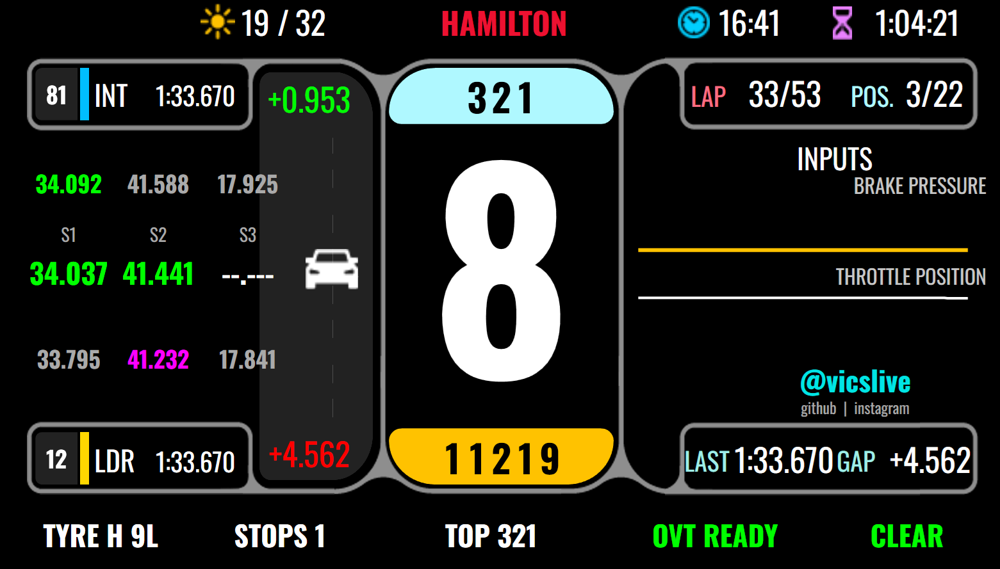

# F1RaceSim_GSIFPEV2 Dashboard — Widget Reference

Companion document to the [main README](README.md). This is the *implementer's guide* to the `F1RaceSim_GSIFPEV2.djson` Dash Studio template — every widget, its binding, and the gotchas discovered while building it.

> **Path:** `C:\Program Files (x86)\SimHub\DashTemplates\F1RaceSim_GSIFPEV2\F1RaceSim_GSIFPEV2.djson`
> **Screen size:** 800 × 480 (GSI Formula Pro Elite V2)
> **All properties live under namespace** `F1SimHubLivePlugin`.



---

## Coordinate system reminder

Dash Studio uses top-left origin. All widget coords are `Left` (X from left edge), `Top` (Y from top), `Width`, `Height`. Z-order is array order: later items render on top of earlier items inside the same `Items[]` or `Childrens[]`.

The V4 background image defines visible "frame" regions:
- Top strip: y ≈ 0–60
- Throttle / brake graph area: y ≈ 60–340 (varies by widget)
- Bottom-right widget frame: starts at **x ≈ 540** (not 470 — calibrated against the V4 background)
- Bottom strip (F1Tyre/Stops/TopSpeed/Overtake/Flag): y ≈ 420–450, font size 22

---

## Top strip

### Flag indicator (top-left) — `IncidentData` Layer group

> The cluster originally came from the iRacing template as an "incidents counter." It's been repurposed as an F1 full-course-caution indicator.

```
[ ▲ ][   YELLOW   ]
```

| Child name | Type | Purpose |
|---|---|---|
| `INCLogo` | ImageItem (red Hazard) | The red warning triangle |
| `IncidentLabel` | TextItem ("INC", red) | Hidden (`Visible:false`) — leftover from iRacing |
| `IncCount` | TextItem | Status text "YELLOW" / "SC" / "RED" / "VSC" |
| `IncSeparator` | TextItem ("/") | Hidden |
| `IncLimit` | TextItem ("/15") | Hidden |

**Critical gotchas:**
1. **The Layer group must stay `Visible:true`.** Hiding the group hides all children — even ones with their own binding-based visibility logic.
2. **Each child's static `Visible` property overrides any `Bindings.Visible`.** Set the static to `true` and let the binding decide actual visibility.

**INCLogo Bindings.Visible** (JS expression, Interpreter=1):
```js
var c = $prop("F1SimHubLivePlugin.TrackStatusCode");
return (c == 2 || c == 4 || c == 5 || c == 6 || c == 7);
```

**IncCount Bindings.Text** (JS expression):
```js
var c = $prop("F1SimHubLivePlugin.TrackStatusCode");
if (c == 2) return "YELLOW";
if (c == 4) return "SC";
if (c == 5) return "RED";
if (c == 6) return "VSC";
if (c == 7) return "VSC";
return "";
```

**IncCount Bindings.TextColor** (JS expression):
```js
var c = $prop("F1SimHubLivePlugin.TrackStatusCode");
if (c == 5) return "#FFFF0000";   // RED flag → red text
return "#FFFFEE00";                 // everything else → amber
```

**IncCount geometry overrides:**
- `Width`: 80 (was 29 — too narrow for "YELLOW")
- `HorizontalAlignment`: 0 (left)
- `Visible`: true (was false)

### Other top-strip widgets

| Widget | Bound to | Note |
|---|---|---|
| `F1LiveLabel` | `DriverLastName` (upper) → `F1 LIVE` fallback | Center title at L=295 W=210 T=17. TextColor still bound to `Status`. |
| `LapDisplay` | `LapDisplay` | Formatted `M/N`. Position calibrated manually. |
| `Position` | `Position` | Position calibrated manually. |
| `DriverNumberDisplay` | static or `CurrentDriverNumber` | |

### `F1LiveLabel` — driver title (top center)

The top-center title shows the user's selected driver's last name (e.g. `VERSTAPPEN`, `HAMILTON`, `HULKENBERG`) so the wheel always identifies which car the telemetry belongs to. Falls back to literal `F1 LIVE` before the DriverList resolves (first 1–2s after connect, or if the upstream feed never delivers driver identity).

**Bindings.Text** (JS expression, Interpreter=1):
```js
var n = $prop('F1SimHubLivePlugin.DriverLastName');
return (n && n.length > 0) ? n.toUpperCase() : 'F1 LIVE';
```

**Bindings.TextColor** (live F1 team colour with status fallbacks):
```js
var s = $prop('F1SimHubLivePlugin.Status');
if (s == 'Connecting') return '#FFFF1801';   // red-orange while connecting
if (s != 'Connected')  return '#FFFFCC00';   // amber when disconnected
var c = $prop('F1SimHubLivePlugin.TeamColour');
if (c && c.length == 6) return '#FF' + c.toUpperCase();  // e.g. Ferrari #E80020
return '#FF22CC44';                            // green fallback when no team colour
```

`TeamColour` is the raw 6-character broadcast hex (no `#`) sourced from the F1 `DriverList` topic via MultiViewer. When the feed resolves Hamilton on Ferrari you'll see `FFE80020`, Russell on Mercedes `FF27F4D2`, etc.

**Geometry:** `Left=295 Top=17 Width=210 Height=34` — wide enough for the longest 2026-grid last name (`HULKENBERG` ≈ 190px in Oswald Bold 24pt) with centered alignment about x=400. The previous static-text widget was 103px wide.

---

## Middle area — Throttle/Brake + Signature

### INPUTS panel — throttle / brake bar charts

Two SimHub `BarChartItem`s plus a header and per-bar labels, mirroring the layout you'd see on a TV broadcast input overlay.

| Widget | Bound to | Position | Style |
|---|---|---|---|
| `InputsHeader` | static `INPUTS` text | L=540 T=128 W=237 H=24 | Oswald Bold FS=22 white, HA=1 |
| `BrakeLabel` | static `BRAKE PRESSURE` text | L=540 T=152 W=237 H=19 | Oswald Bold FS=16 white, HA=1 |
| `BrakeChart` | `$prop('F1SimHubLivePlugin.Brake')` | L=495 T=168 W=280 H=55 | Color `#FFFFC200` (yellow), Thickness=3, PointsCount=100 |
| `ThrottleLabel` | static `THROTTLE POSITION` text | L=540 T=223 W=237 H=19 | Oswald Bold FS=16 white, HA=1 |
| `ThrottleChart` | `$prop('F1SimHubLivePlugin.Throttle')` | L=495 T=239 W=280 H=55 | Color `#FFFFFFFF` (white), Thickness=2, PointsCount=100 |

Brake on top (yellow) and throttle on bottom (white) match the F1 international-feed convention.

### `@vicslive` Signature

Personal handle in the slot between the throttle-graph bottom (T≈338) and the LAST/GAP cluster top (T=357).

| Widget | Text | Position | Style |
|---|---|---|---|
| `SignatureHandle` | `@vicslive` | L=572 T=300 W=205 H=28 | Oswald Bold FS=22 cyan `#FF00E5E5`, HA=1 VA=1 |
| `SignaturePlatforms` | `github  ·  instagram` | L=572 T=328 W=205 H=15 | Oswald Normal FS=12 gray `#FFAAAAAA`, HA=1 VA=1 |

Font size matches the bottom strip's FS=22 per user preference.

---

## Sectors cluster (mid-left)

Three rows, each with three sector slots: **own driver**, **car ahead (INT)**, **leader (LDR)**.

### Own driver row
| Widget | Bound to | Color logic |
|---|---|---|
| `Sector1Time` | `Sector1Time` | purple if `Sector1IsOverallBest`, green if `Sector1IsPersonalBest`, yellow otherwise |
| `Sector2Time` | `Sector2Time` | same scheme on sector 2 |
| `Sector3Time` | `Sector3Time` | same scheme on sector 3 |

### INT row (car directly ahead)
| Widget | Bound to | Notes |
|---|---|---|
| `AheadNumber` | `AheadCarNumber` | Dark rounded-left pill (BackgroundColor=`#FF222222`, RadiusTopLeft=5, RadiusBottomLeft=5). H=41 W=33. Font Oswald Bold FS=18. HA=1 VA=1. |
| `AheadSector1Time` | `AheadSector1Time` | color from `AheadSector1Is*` flags |
| `AheadSector2Time` | `AheadSector2Time` | ditto |
| `AheadSector3Time` | `AheadSector3Time` | ditto |

`AheadNumber` Bindings.Text:
```js
var v = $prop('F1SimHubLivePlugin.AheadCarNumber');
return (v && v != '') ? v : '';
```

### LDR row (race leader)
| Widget | Bound to | Notes |
|---|---|---|
| `BehindNumber` | `LeaderCarNumber` (blank if `Position==1`) | Same dark pill as `AheadNumber` |
| `LeaderSectorNTime` | `LeaderSectorNTime` + `LeaderSectorNIs*` flags | mirror of INT |

`BehindNumber` Bindings.Text:
```js
var pos = $prop('F1SimHubLivePlugin.Position');
if (pos == 1 || pos == '1') return '';
var v = $prop('F1SimHubLivePlugin.LeaderCarNumber');
return (v && v != '') ? v : '';
```

---

## LAST / GAP cluster (bottom-right of widget frame)

Manually calibrated by Vic to fit the V4 background's bottom-right frame.

| Widget | Text | Position |
|---|---|---|
| `LASTLabel` | `LAST` | L=541 T=357 |
| `AvgVal` (last lap time) | `LastLapTime` | L=548 T=353 HA=2 |
| `GAPLabel` | `GAP` | L=660 T=357 |
| `LapsVal` (gap to leader) | `GapToLeader` | L=680 T=353 HA=2 |

The cluster sits between L=541 and L≈765, giving 224px of usable width inside the V4 frame.

---

## Bottom strip (y ≈ 420–450, FS=22)

Single row of five info pills, left to right:

| Widget | Bound to | Notes |
|---|---|---|
| `F1Tyre` | `TyreCompoundShort` + `TyreAge` | e.g. `S 14` |
| `F1Stops` | `PitStopCount` | |
| `F1Top` (Top Speed) | `TopSpeed` + `TopSpeedRank` | rank highlighted if =1 |
| `F1Ovt` (Overtake) | `OvertakeAvailable` | bool indicator |
| `F1Flag` | `FlagText` (priority) → `TrackStatusCode` (fallback) | see below |

### F1Flag binding (synced with top-left triangle)

**Text:**
```js
var f = $prop('F1SimHubLivePlugin.FlagText');
if (f && f != '' && f != 'CLEAR') return f;
var c = $prop('F1SimHubLivePlugin.TrackStatusCode');
if (c == 2) return 'YELLOW';
if (c == 4) return 'SC';
if (c == 5) return 'RED';
if (c == 6 || c == 7) return 'VSC';
if (c == 1 || c == 3) return 'CLEAR';
return f && f != '' ? f : '--';
```

**TextColor:**
```js
var f = $prop('F1SimHubLivePlugin.FlagText');
var c = $prop('F1SimHubLivePlugin.TrackStatusCode');
var s = (f && f != '' && f != 'CLEAR') ? f
      : (c == 2 ? 'YELLOW'
        : c == 4 ? 'SC'
        : c == 5 ? 'RED'
        : c == 6 || c == 7 ? 'VSC'
        : c == 1 || c == 3 ? 'CLEAR' : f);
if (s == 'GREEN' || s == 'CLEAR') return '#FF00FF00';
if (s == 'YELLOW' || s == 'DOUBLE YELLOW' || s == 'SC' || s == 'VSC') return '#FFFFC800';
if (s == 'RED') return '#FFFF4040';
if (s == 'CHEQUERED') return '#FFFFFFFF';
return '#FFAAAAAA';
```

---

## Color palette (broadcast standard)

| State | Hex | Where used |
|---|---|---|
| Green (clear) | `#FF00FF00` | F1Flag CLEAR/GREEN |
| Amber (caution) | `#FFFFC800` (bottom) / `#FFFFEE00` (top IncCount) | YELLOW / SC / VSC |
| Red (stoppage) | `#FFFF4040` / `#FFFF0000` | RED flag |
| White (finish) | `#FFFFFFFF` | CHEQUERED |
| Gray (idle) | `#FFAAAAAA` | F1Flag fallback / Signature platforms |
| Cyan (signature) | `#FF00E5E5` | `@vicslive` |
| Pill background | `#FF222222` | AheadNumber / BehindNumber |
| Purple (overall best) | varies | Sector splits |

---

## Editing the djson safely

The djson is a single-line JSON document — visually scary, mechanically simple. Recommended workflow:

1. **Always back up before editing:**
   ```powershell
   $path = "C:\Program Files (x86)\SimHub\DashTemplates\F1RaceSim_GSIFPEV2\F1RaceSim_GSIFPEV2.djson"
   Copy-Item $path "$path.bak-$(Get-Date -Format 'yyyyMMdd-HHmmss')"
   ```
2. **Use string-replace, not character-position-replace.** Lengths shift the moment you add anything.
3. **Walk balanced `{}` for widget block boundaries:**
   ```powershell
   $idx = $j.IndexOf('"Name":"WidgetName"')
   $start = 0; $depth = 0
   for ($i = $idx; $i -ge 0; $i--) {
       if ($j[$i] -eq '}') { $depth++ }
       if ($j[$i] -eq '{') { if ($depth -eq 0) { $start = $i; break } $depth-- }
   }
   ```
4. **Validate JSON before writing:**
   ```powershell
   try { $null = $modified | ConvertFrom-Json; Set-Content $path $modified -NoNewline } catch { Write-Host "JSON FAILED: $_" }
   ```
5. **Restart SimHub** to reload the dashboard. Editing while SimHub runs doesn't hot-reload.

### Property-vs-Bindings precedence

For every property like `Visible`, `Text`, `TextColor`, etc.:
- Static property on the widget (`"Visible":false`) is the default value.
- If a matching `Bindings.PropertyName` exists, SimHub evaluates the JS expression every frame and uses that result instead — **BUT** static `Visible:false` short-circuits rendering before the binding runs.
- Rule of thumb: when adding a `Bindings.X`, also set the static `X` to a neutral value (e.g. `Visible:true`, `Text:""`).

### Layer group precedence

Widgets inside a Layer's `Childrens[]` only render when the Layer's `Visible` is true. Hiding the parent Layer kills the children's visibility regardless of their own bindings.

---

## Quick verification commands

```powershell
# Plugin state check
foreach ($p in 'Status','Position','LapDisplay','TrackStatusCode','TrackStatus','FlagText',
               'AheadCarNumber','LeaderCarNumber','LastLapTime','GapToLeader') {
  $v = curl.exe -s "http://127.0.0.1:8888/api/getproperty/F1SimHubLivePlugin.$p"
  Write-Host ("{0,-22} = {1}" -f $p,$v)
}
```

```powershell
# Live flag-status monitor (prints transitions)
$decode = @{ '1'='CLEAR';'2'='YELLOW';'3'='GREEN(after)';'4'='SC';'5'='RED';'6'='VSC';'7'='VSC_END' }
$last = ""
while ($true) {
  $c = (curl.exe -s "http://127.0.0.1:8888/api/getproperty/F1SimHubLivePlugin.TrackStatusCode").Trim()
  if ($c -ne $last) {
    Write-Host ("[{0}] {1} ({2})" -f (Get-Date -Format HH:mm:ss), $c, $decode[$c])
    $last = $c
  }
  Start-Sleep -Milliseconds 500
}
```
