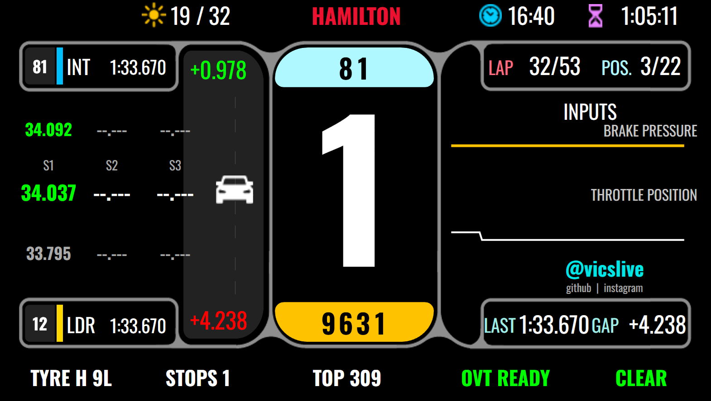

# F1SimHubLive

**SimHub plugin + custom Dash Studio dashboard that pipes live Formula 1 telemetry from F1's broadcast feed (or MultiViewer replay) onto a SimHub-connected wheel screen.**


The current ``F1RaceSim_GSIFPEV2`` dashboard is laid out for an 800×480 wheel screen and has been validated on the [GSI Formula Pro Elite V2](https://gomezsimindustries.com/products/formula-pro-elite-v2) and [GSI Hyper P1](https://gomezsimindustries.com/products/hyper-p1). Any other SimHub-LCD-capable wheel at the same resolution should also work; resolutions other than 800×480 will crop or scale.

You pick a driver number (`44` = Hamilton, `1` = Verstappen, `16` = Leclerc, …). The plugin pulls that driver's RPM, gear, speed, throttle, brake, DRS, lap time, sector splits, gap to leader, tyre compound, pit stops, weather, track status and race-control flags. The companion `F1RaceSim_GSIFPEV2` dashboard renders all of it as a broadcast-style dash with shift lights driven by the live RPM.

This is a fan tool for use during F1 broadcasts on F1 TV / official live timing.

```
F1 TV broadcast (~1–3s behind live)
        │
        ▼
[ livetiming.formula1.com SignalR ]            [ F1 MultiViewer local HTTP ]
        │                                              │
        └──────────────┬───────────────────────────────┘
                       ▼
              F1SimHubLive plugin (this repo)
                       │ (60 Hz interpolated render of ~3–10 Hz feed)
                       ▼
              SimHub property tree
                       │
                       ▼
              F1RaceSim_GSIFPEV2 Dash Studio dashboard
                       │
                       ▼
          Your SimHub-connected wheel screen + LEDs
```

---

## Table of contents

1. [Quick install (installer)](#quick-install-installer)
2. [Fresh-machine setup (first-time GSI wheel)](#fresh-machine-setup-first-time-gsi-wheel)
3. [What it does](#what-it-does)
4. [Architecture](#architecture)
5. [Two data sources: F1 Live vs MultiViewer](#two-data-sources-f1-live-vs-multiviewer)
6. [SimHub property reference](#simhub-property-reference)
7. [F1RaceSim_GSIFPEV2 dashboard](#F1RaceSim_GSIFPEV2-dashboard)
8. [Driver Picker (mid-race driver switching)](#driver-picker-mid-race-driver-switching)
9. [Build the plugin](#build-the-plugin)
10. [Install (manual)](#install-manual)
11. [Configure](#configure)
12. [Run a session](#run-a-session)
13. [Troubleshooting](#troubleshooting)
14. [File layout](#file-layout)
15. [Known limitations](#known-limitations)
16. [License](#license)
17. [Companion docs](#companion-docs)
18. [Contributing](#contributing)

---

## Quick install (installer)

The easiest way to deploy F1SimHubLive to a new machine (for example, your media-room PC where you watch F1 TV via MultiViewer):

1. Download the latest `F1SimHubLive-Installer.exe` from the [Releases](https://github.com/vicslive/F1SimHubLive/releases) page.
2. **Prerequisites on the target machine** (install in this exact order if the wheel has never been connected to this PC before — see [Fresh-machine setup](#fresh-machine-setup-first-time-gsi-wheel) below):
   - [SimHub](https://www.simhubdash.com/) installed.
   - [F1 MultiViewer](https://multiviewer.app/) installed and signed in with an active [F1 TV](https://f1tv.formula1.com/) subscription.
   - **A Live Timing session running inside MultiViewer** — for a replay, after loading the session you must click **"Replay Live Timing"** so the local API at `http://localhost:10101` actually emits telemetry. Watching only the video feed is *not* enough; the prereq probe and the plugin both pull from the Live Timing data stream, which is only active in that view.
   - **GSI SimOS** installed (the wheel's vendor companion — install BEFORE plugging in the wheel for the first time).
   - Your GSI wheel connected via USB and visible in SimHub *Devices*.
3. Right-click the .exe → *Run as administrator* (it needs to write under `Program Files (x86)\SimHub\`).
4. Walk through the four-step wizard:
   - **Welcome** — overview.
   - **Prerequisites** — auto-detects SimHub + F1 MultiViewer install paths, probes the MultiViewer API to confirm your F1 TV subscription is active **and** that Live Timing is actively streaming (a successful `SessionInfo` response — not just `Heartbeat`).
   - **Driver & source** — pick any driver from the dropdown (loaded live from MultiViewer's current grid, with a bundled fallback list). Choose data source (MultiViewer recommended — works for both live and replays).
   - **Install** — copies the plugin DLLs, dashboard files, writes `F1SimHubLive.Settings.json`, **rewires any legacy plugin-name references in per-device LED configurations** (see [LED config auto-rewire](#led-config-auto-rewire) below), and restarts SimHub.
5. After install, in SimHub: enable the plugin under *Settings → Plugins*, then open *Dash Studio → F1RaceSim_GSIFPEV2* and select it on your wheel.

The installer is a single self-contained .exe (~90 MB) — no .NET runtime install required on the target machine. Source for the installer lives under [`installer/`](installer/).

### Update check (built into the installer)

On launch, the installer asks the GitHub Releases API whether a newer version exists. If yes, a yellow banner appears at the top of the Welcome page with a **Download** button (opens the latest release in your browser) and a **Continue** button (proceed with what you have). The check runs once per launch, has a 3-second timeout, and **never blocks install** — if you're offline, GitHub is rate-limiting, or anything else goes wrong, the banner simply stays hidden and the installer behaves exactly as before. This means an installer .exe sitting in your Downloads folder for months won't silently put you out of date — it will tell you when you run it.

The installer also reads `FileVersionInfo` of any existing `F1SimHubLive.dll` already deployed under your SimHub directory and logs both the existing and freshly-installed versions to the deploy log pane, so upgrades are explicit (e.g. *"Existing F1SimHubLive.dll detected — version 1.1.0. … Installed F1SimHubLive.dll version 1.1.1."*) rather than silent overwrites.

### LED config auto-rewire

This plugin was renamed twice during early development (`F1SimSubGSIPlugin` → `F1SimHubGSIPlugin` → `F1SimHubLivePlugin`). Plugin-name string references live in two places SimHub uses:

1. **Dashboard files** (`*.djson`) — these have always been kept in sync with each rename.
2. **Per-device LED configurations** (`PluginsData\Common\Devices\<guid>\settings.json`) — these were NOT touched by earlier installers. If you ran a pre-v1.0.3 install (or hand-authored your LED zones against an early build of the plugin), every zone-enable formula like `if([F1SimSubGSIPlugin.RpmPercent] > 78, 1, 0)` silently evaluates to 0 once the old plugin DLL is uninstalled — and your wheel LEDs blink white only with no RPM gradient.

From v1.0.3 onward, the installer scans every SimHub device's `settings.json`, replaces any `F1SimSubGSIPlugin.` and `F1SimHubGSIPlugin.` prefixes with `F1SimHubLivePlugin.`, and writes a timestamped `settings.json.preLedRewire-<YYYYMMDD-HHMMSS>` backup before mutating each touched file. The pass is idempotent — re-running the installer on an already-clean device is a no-op and creates no extra backups.

You'll see lines like this in the deploy log pane:
```
Scanning per-device LED configurations for stale plugin-name references...
Device 'GSI Formula Pro Elite V2': backed up settings.json -> settings.json.preLedRewire-20260525-204334
Device 'GSI Formula Pro Elite V2': rewired 10 legacy plugin reference(s) -> F1SimHubLivePlugin.*.
LED config rewire: patched 10 reference(s) across 1 device(s).
```

---

## Fresh-machine setup (first-time GSI wheel)

If the target PC has **never had a [GSI Formula Pro Elite V2](https://gomezsimindustries.com/products/formula-pro-elite-v2) wheel connected**, follow this exact order. Doing it out of order is the single most common cause of "wheel shows up but LCD/LEDs don't work" headaches.

### Why order matters

When Windows sees a new USB HID device, it auto-binds a **generic HID driver**. That driver is enough to expose buttons and axes to games, but it does **not** expose the wheel's LCD, RGB LEDs, or programmable features. The vendor companion (GSI SimOS) installs the device profile that unlocks those — but only if it's installed **before** the wheel is first enumerated. If you plug in first and install second, you may end up with a partially-bound device that needs to be unplugged + replugged before the full feature set comes online.

### Recommended install order

1. **Install SimHub** — <https://www.simhubdash.com/>. Default install path (`C:\Program Files (x86)\SimHub\`). Run it once so the first-launch wizard completes.
2. **Install F1 MultiViewer** — <https://multiviewer.app/>. Sign in with your F1 TV Pro account. Start a session (live or replay) **and open Live Timing** — for replays, click the **"Replay Live Timing"** button on the session card. Confirm `http://localhost:10101/api/v1/live-timing/SessionInfo` returns populated JSON in your browser. *(MultiViewer is only needed if you'll use the `MultiViewer` data source. The `F1Live` source talks to F1's broadcast SignalR feed directly and does not need MultiViewer. Note: just watching the F1 video stream inside MultiViewer is not enough — telemetry only flows once Live Timing is running.)*
3. **Install GSI SimOS** — get the latest installer from the wheel's product page at <https://gomezsimindustries.com/products/formula-pro-elite-v2>. **Do this with the wheel UNPLUGGED.** Reboot if the installer asks you to.
4. **Plug the wheel into USB** (wheel powered off → plug → power on, or follow the order in your wheel's quick-start card). Windows will run final HID enumeration; SimOS should pop up or sit in the tray and recognize the wheel.
5. **Open SimOS** and verify the wheel is detected. If it prompts for a firmware update, run it now — *do not unplug the wheel mid-update*. Wait for the "complete" confirmation before doing anything else.
6. **Open SimHub** → *Settings → Devices* → confirm the wheel appears (typically as a GSI device on a HID path). Add it as a controllable device if SimHub doesn't auto-add it.
7. **Run `F1SimHubLive-Installer.exe`** (this repo's installer) as administrator. The wizard auto-detects SimHub + MultiViewer, lets you pick a driver, deploys the plugin DLLs + dashboard, and restarts SimHub.
8. **In SimHub** → *Settings → Plugins* → enable **F1SimHubLive**. Then *Dash Studio → F1RaceSim_GSIFPEV2* → assign it to the GSI device.

### If you already plugged the wheel in first

Not catastrophic. Do this:

1. Close SimHub.
2. **Unplug the wheel** from USB and power it off.
3. Install GSI SimOS.
4. Reboot.
5. Plug the wheel back in, power it on, let SimOS finish enumeration.
6. Continue from step 5 above.

### Quick verification before you bother with the dashboard

In **Device Manager**, the wheel should appear under *Human Interface Devices* with no yellow warning triangle. In SimHub *Devices*, button presses should register a green ring around the input list. If both of those are clean, the plugin + dashboard install on top will work.

---

## What it does

**Live telemetry (60 Hz interpolated):**
- RPM, RpmPercent (0–100 normalized over 13,000)
- Gear (0–8)
- Speed (km/h)
- Throttle / Brake (0–100)
- DRS (raw code + `DrsActive` / `DrsEligible` bool)

**Per-driver timing (1 Hz race-control refresh):**
- Position (1st–20th)
- Lap, CurrentLap / TotalLaps, `LapDisplay` (e.g. `47/53`)
- BestLapTime, LastLapTime
- GapToLeader, IntervalToAhead
- InPit, PitStopCount
- TyreCompound + short letter (`S`/`M`/`H`/`I`/`W`), TyreAge
- Sector 1/2/3 times + personal-best + overall-best flags
- Ahead driver's sectors + **AheadCarNumber**
- Leader's sectors + **LeaderCarNumber**
- TopSpeed in km/h + TopSpeedRank
- OvertakeSystemEnabled / OvertakeAvailable

**Session state:**
- SessionTimeRemaining (`HH:MM:SS`)
- TrackStatus (text) and **TrackStatusCode** (1=AllClear, 2=Yellow, 3=GreenAll, 4=SC, 5=Red, 6=VSC, 7=VSC_Ending)
- FlagText — last race-control flag broadcast (GREEN, YELLOW, DOUBLE YELLOW, SC, VSC, RED, CHEQUERED)
- TotalDrivers

**Weather:**
- AirTemp °C, TrackTemp °C, Humidity %, Rainfall bool, WindSpeedKph

---

## Architecture

```
┌─────────────────────────────────────────────────────────────────┐
│ Data source (one of)                                             │
│  • F1SignalRClient  → wss://livetiming.formula1.com (broadcast)  │
│  • MultiViewerHttpClient → http://localhost:10101 (replay)       │
└─────────────────────────────────────────────────────────────────┘
                        │ raw SignalR/JSON
                        ▼
┌─────────────────────────────────────────────────────────────────┐
│ Decoders (per F1 topic)                                          │
│  CarData.z         → DriverSnapshot   (RPM/Gear/Speed/Throt/etc) │
│  TimingData        → TimingSnapshot   (Pos/Gap/Sectors/etc)      │
│  TimingStats       → TopSpeed                                    │
│  TimingAppData     → Tyre compound/age, pit stops                │
│  WeatherData       → WeatherSnapshot                             │
│  TrackStatus       → SessionSnapshot.TrackStatusCode/Message     │
│  LapCount          → CurrentLap / TotalLaps                      │
│  RaceControl       → FlagText                                    │
│  SessionData       → SessionTimeRemaining                        │
│  DriverList        → driver→racing-number map                    │
│  ExtrapolatedClock → session clock fallback                      │
└─────────────────────────────────────────────────────────────────┘
                        │
            ┌───────────┴──────────────┐
            ▼                          ▼
    TelemetryBuffer          OnTimingSnapshot/OnSessionSnapshot/
    (prev + curr car         OnWeatherSnapshot/OnStatus events
     snapshot, ring)
            │
            ▼
    Interpolator (60 Hz)
            │
            ▼
    F1SimHubLivePlugin.DataUpdate / per-event setters
            │
            ▼
    SimHub PluginManager.SetPropertyValue(...)
            │
            ▼
    F1RaceSim_GSIFPEV2.djson (Dash Studio) → GSI wheel HID screen + LEDs
```

**Why 60 Hz interpolation?** The broadcast multiplexes ~20 cars onto a single feed; per-car samples arrive at roughly 3–10 Hz with jitter. The plugin holds a ~200 ms render buffer and linearly interpolates between the last two snapshots so shift lights, throttle bars and RPM gauges look smooth instead of stepping.

---

## Two data sources: F1 Live vs MultiViewer

Set `Source` in `F1SimHubLive.Settings.json`:

| Value | What it connects to | When to use |
|---|---|---|
| `F1Live` (default) | `livetiming.formula1.com` SignalR 2.x hub `Streaming` | Live sessions only (FP1/2/3, Q, Sprint, Race). Data flows only while F1 is actively broadcasting. |
| `MultiViewer` | Local F1 MultiViewer app at `http://localhost:10101` | Replays from F1 TV recordings, paused sessions, or testing outside live windows. Requires MultiViewer running with a session loaded **and Live Timing actively running** — for replays, click "Replay Live Timing" on the session. Watching only the video feed produces no telemetry. |

The F1Live source has zero local dependencies. MultiViewer mode lets you scrub through past races for testing — used heavily during development to validate the dashboard against known SC/VSC/yellow events.

---

## SimHub property reference

All properties are exposed under the **`F1SimHubLivePlugin`** namespace (class name, not `[PluginName]` attribute). In Dash Studio bindings use `$prop('F1SimHubLivePlugin.X')` or `[F1SimHubLivePlugin.X]`.

### Car telemetry (interpolated 60 Hz)
| Property | Type | Range / values |
|---|---|---|
| `Rpm` | double | 0–~15000 |
| `RpmPercent` | double | 0–100 (normalized over 13000) |
| `Gear` | int | 0=N/R, 1–8 |
| `Speed` | double | km/h |
| `Throttle` | double | 0–100 |
| `Brake` | double | 0–100 |
| `Drs` | int | raw DRS code |
| `DrsActive` | bool | true if 10/12/14 |
| `DrsEligible` | bool | true if eligibility flag set |

### Driver timing
| Property | Notes |
|---|---|
| `Position` | string, current finishing position |
| `Lap` | this driver's lap counter |
| `BestLapTime` / `LastLapTime` | formatted `M:SS.ddd` |
| `GapToLeader` | `+12.345` or `+1 LAP` |
| `IntervalToAhead` | gap to car directly ahead |
| `InPit` | bool |
| `TyreCompound` / `TyreCompoundShort` | `SOFT` / `S`, etc. |
| `TyreAge` | int laps |
| `PitStopCount` | int |
| `TopSpeed` | string km/h |
| `TopSpeedRank` | int (1 = fastest in field) |
| `OvertakeSystemEnabled` | bool |
| `OvertakeAvailable` | bool |

### Sectors (this driver)
| Property | Type |
|---|---|
| `Sector1Time` / `Sector2Time` / `Sector3Time` | string |
| `SectorNIsPersonalBest` | bool (green) |
| `SectorNIsOverallBest` | bool (purple) |

### Sectors (driver ahead + race leader)
| Property | Notes |
|---|---|
| `AheadCarNumber` | F1 racing number of car directly in front |
| `LeaderCarNumber` | F1 racing number of current leader |
| `AheadSectorNTime` / `AheadSectorNIs(Personal/Overall)Best` | mirrors above |
| `LeaderSectorNTime` / `LeaderSectorNIs(Personal/Overall)Best` | mirrors above |

### Session
| Property | Type |
|---|---|
| `CurrentLap` / `TotalLaps` | int |
| `LapDisplay` | string `47/53` |
| `SessionTimeRemaining` | string `HH:MM:SS` |
| `TrackStatus` | string |
| `TrackStatusCode` | int (see below) |
| `FlagText` | string (RC broadcast) |
| `TotalDrivers` | int |

**TrackStatusCode values:**
| Code | Meaning |
|---|---|
| 1 | AllClear |
| 2 | Yellow |
| 3 | Green (transitional after yellow) |
| 4 | Safety Car (SC) |
| 5 | Red Flag |
| 6 | VSC Deployed |
| 7 | VSC Ending |

### Weather
`AirTemp` (°C), `TrackTemp` (°C), `Humidity` (%), `Rainfall` (bool), `WindSpeedKph`.

### Meta
| Property | Notes |
|---|---|
| `Source` | `F1Live` or `MultiViewer` |
| `CurrentDriverNumber` | driver being tracked |
| `Status` | connection state (`Initializing` → `Connecting` → `Connected` → …) |

### Driver identity (auto-resolved from DriverList)
Populated once per session as soon as the upstream `DriverList` is fetched. Empty strings until then.

| Property | Example | Notes |
|---|---|---|
| `DriverTla` | `VER` | Three-letter code |
| `DriverFirstName` | `Max` | As provided by F1 feed |
| `DriverLastName` | `Verstappen` | Use `.toUpperCase()` in dashboard for broadcast style |
| `DriverFullName` | `Max VERSTAPPEN` | Feed-provided full name |
| `DriverBroadcastName` | `M VERSTAPPEN` | F1 broadcast convention; synthesized when feed omits it |
| `TeamName` | `Red Bull Racing` | |
| `TeamColour` | `3671C6` | Team accent hex (no leading `#`) |

---

## F1RaceSim_GSIFPEV2 dashboard

`F1RaceSim_GSIFPEV2` is a custom Dash Studio template that ships in `dashboards/F1RaceSim_GSIFPEV2.djson`. It mimics the F1 TV broadcast graphic layout, scaled for the GSI wheel's 800×480 screen.



### Layout

The screen is laid out as a 3-column broadcast grid: **left = timing column**, **center = telemetry column**, **right = pace column**, plus a top status strip and a bottom data strip.

```
┌────────────────────────────────────────────────────────────────────┐
│ ☀ 19/33          HAMILTON          🕐 16:14    ⏳ 1:31:19          │  TOP STRIP
│  AirT/TrkT      (driver name,      session     session time         │
│   °C            in team color)     clock       remaining            │
├────────────────────────────────────────────────────────────────────┤
│ [12 INT]                              ┌────────┐                    │
│        +2.757                         │  303   │  LAP 19/53 POS 4/22│
│ 34.399  41.758  17.938                │ SPEED  │                    │
│   S1     S2      S3                   │        │  INPUTS            │
│                                       │  🚗    │  BRAKE PRESSURE    │
│ 34.919  41.921  18.119                │        │  ━━━━━━━━━━━━━━━   │
│   ←  own driver, color-coded          │   8    │  THROTTLE POSITION │
│       (purple=overall, green=PB,      │ GEAR   │  ━━━━━━━━━━━━━━━   │
│        yellow=other)                  │        │                    │
│                                       │ 10580  │  @vicslive         │
│ 34.720  42.014  18.054                │  RPM   │  github · instagram│
│  ←  leader's reference sectors        └────────┘                    │
│        +5.985                                                       │
│ [63 LDR]                                       LAST 1:34.959        │
│                                                GAP  +5.985          │
├────────────────────────────────────────────────────────────────────┤
│ TYRE M 17L   STOPS 0   TOP 324   OVT WAIT             CLEAR        │  BOTTOM STRIP
│ compound/age stops     top speed  overtake mode     flag/track state│
└────────────────────────────────────────────────────────────────────┘
```

**Top strip** — at-a-glance session context: live weather (air / track temp with a sun or rain icon), the selected driver's last name in the live team colour, the wall-clock time, and the session time remaining.

**Center telemetry column** — the big numbers you actually drive by: live **SPEED** (km/h, cyan box), the selected driver's current **GEAR** (huge white digit, dominates the screen), and **RPM** (yellow box, also reflected in the shift-light LEDs). RPM-driven shift lights wrap the screen edge.

**Left timing column** — sector splits laid out like the F1 international feed timing tower:
- Top: `INT` pill (car directly ahead, with its car number) + the gap to it (`+2.757`), then that car's last three sector times.
- Middle: **your** driver's three sector times, coloured purple for overall-best, green for personal-best, yellow otherwise.
- Bottom: leader's three sector times + the gap to leader (`+5.985`) + `LDR` pill with leader's car number.

**Right pace column** — LAP `M/N` and POSITION `X/N` pills, the **INPUTS** panel (`BRAKE PRESSURE` yellow bar above, `THROTTLE POSITION` white bar below — same convention as the F1 international feed input overlay), the `@vicslive` signature widget, and a LAST/GAP readout for the selected driver's most recent lap time and current race gap to leader.

**Bottom strip** — race-status data row: tyre compound (`M`/`S`/`H`/`I`/`W`) plus age in laps, pit-stop count, top speed (running max + speed-trap fused — see [the changelog](CHANGELOG.md)), overtake mode availability, and a flag widget (`CLEAR` / `YELLOW` / `SC` / `VSC` / `RED` / `CHEQUERED`) synced with a red triangle in the top-left for full-course-caution states.

### Widget binding map

| Widget | Bound to | Notes |
|---|---|---|
| Shift lights (LEDs) | `RpmPercent` | 12000 RPM ≈ 92% → all green; 13000 RPM = 100% red. |
| `Speed` cyan box | `Speed` | km/h |
| Big `Gear` digit | `Gear` | dominates the center column |
| `Rpm` yellow box | `Rpm` | numeric, matches the LED bar |
| Throttle bar (`ThrottleChart`) | `Throttle` | white, labelled `THROTTLE POSITION` |
| Brake bar (`BrakeChart`) | `Brake` | yellow, labelled `BRAKE PRESSURE` |
| DRS indicator | `DrsActive` / `DrsEligible` | |
| `LAP` pill | `LapDisplay` | format `M/N` (current/total) |
| `POS` pill | `Position` + `TotalDrivers` | format `X/N` |
| Driver name title | `DriverLastName` upper-case → `F1 LIVE` fallback. TextColor uses `TeamColour` when `Status='Connected'`. | Live broadcast colour (Ferrari `#E80020`, Mercedes `#27F4D2`, etc.) |
| `AheadNumber` pill | `AheadCarNumber` | "INT" pill to the LEFT of the ahead sectors row |
| `BehindNumber` pill | `LeaderCarNumber` (blank if `Position==1`) | "LDR" pill to the LEFT of the leader sectors row |
| Own sector 1/2/3 | `SectorNTime` + `SectorNIs(Personal/Overall)Best` | purple = overall-best, green = personal-best, yellow = other |
| INT sectors row | `AheadSectorNTime` + ahead best flags | car directly in front |
| LDR sectors row | `LeaderSectorNTime` + leader best flags | race leader |
| Gap to ahead (`+2.757`) | `IntervalToAhead` | shown between INT pill and your driver's sectors |
| Gap to leader (`+5.985`) | `GapToLeader` | shown above the LDR pill |
| LAST / GAP cluster | `LastLapTime` / `GapToLeader` | inside the right pace column |
| Weather (top-left) | `AirTemp` / `TrackTemp` / `Rainfall` | sun / rain icon driven by `Rainfall` boolean |
| Session clock (top-right) | `SessionClock` | wall-clock time string |
| Session time remaining (top-right) | `SessionTimeRemaining` | hourglass icon |
| Tyre (`TYRE`) | `TyreCompoundShort` + `TyreAge` | bottom strip |
| Stops (`STOPS`) | `PitStopCount` | bottom strip |
| Top Speed (`TOP`) | `TopSpeed` + `TopSpeedRank` | bottom strip — running max of every live `Speed` sample fused with the upstream `BestSpeeds.ST` snapshot, sanity-capped at 450 km/h |
| Overtake (`OVT`) | `OvertakeAvailable` | bottom strip — `WAIT` / `READY` / `USED` |
| Top-left triangle (`INCLogo` + `IncCount`) | `TrackStatusCode` | Repurposed from iRacing incidents counter. Shows when code ∈ {2,4,5,6,7}. Text: YELLOW / SC / RED / VSC. Color: red for RED flag, amber otherwise. |
| Bottom-right `F1Flag` | `FlagText` (priority) → fallback `TrackStatusCode` | Synced with top triangle. Green for CLEAR/GREEN, amber for YELLOW/SC/VSC/DOUBLE YELLOW, red for RED, white for CHEQUERED. |
| `@vicslive` signature | static | Personal handle widget, sits between the INPUTS panel and the LAST/GAP readout in the right column. |

### Caution status — two complementary widgets

The dashboard uses **two** flag indicators that stay in sync:

- **Top-left triangle** (`INCLogo` red hazard + `IncCount` text): driven by `TrackStatusCode` (persistent track state). Hidden when CLEAR.
- **Bottom-right `F1Flag`**: driven by `FlagText` (race-control broadcast); falls back to `TrackStatusCode` when no active RC message so the two stay aligned during VSC/SC/YELLOW.

**Color convention** (per F1 broadcast standard):
- 🟢 Green text = CLEAR / GREEN
- 🟡 Amber text + 🔺 red triangle = YELLOW / SC / VSC (race continues, caution active)
- 🔴 Red text + 🔺 red triangle = RED flag (race halted)
- ⚪ White text = CHEQUERED (race finished)

---

## Driver Picker (mid-race driver switching)

Hamilton crashes on lap 23. You want to flip the wheel to Antonelli without
stopping SimHub, editing JSON, and sitting through MultiViewer's ~30-second
warm-up after a restart. That's what the **F1SimHubLive Driver Picker** is for.

<!-- Screenshot to be added after the next release: docs/screenshots/picker.png -->

### Visual layout

```
┌──────────────────────────────────┐
│ F1SimHubLive — Driver Picker  ⌄ │
├──────────────────────────────────┤
│ ┌────┐ Lando NORRIS              │
│ │NOR │ McLaren · 374 pts      4  │  ← team-coloured tile + name/team/points + race number
│ └────┘                           │
│ ┌────┐ Oscar PIASTRI             │
│ │PIA │ McLaren · 356 pts     81  │  ← same team paired, ordered by points
│ └────┘                           │
│ ┌────┐ George RUSSELL            │
│ │RUS │ Mercedes · 245 pts    63  │
│ └────┘                           │
│ ┌────┐ Kimi ANTONELLI            │
│ │ANT │ Mercedes · 64 pts     12  │
│ └────┘                           │
│   …                              │
│ ┌────┐ Lewis HAMILTON            │  ← currently active driver: coloured border
│ │HAM │ Ferrari · 142 pts     44  │
│ └────┘                           │
└──────────────────────────────────┘
```

Click any driver tile. The row flashes green for 500ms. About one second later
your wheel is showing that driver's RPM, gear, speed, lap, gap, sectors —
without SimHub or MultiViewer being touched.

### What it does

- Standalone WPF window, ~320×640, always-on-top by default. Designed to live
  in the corner of a second monitor during the race.
- Polls MultiViewer's `DriverList` every 5 seconds, so it always shows the
  current grid. Bundled fallback list when MV is unreachable.
- Drivers are **grouped by team**, and **teams are ordered by current
  Constructors' Championship position** (from MultiViewer's
  `ChampionshipPrediction`). Within a team, the higher-points driver is
  listed first. Each driver's current points tally is shown subtly under
  their racing number.
- One click on a driver writes the new `DriverNumber` to `settings.json`. The
  plugin's `FileSystemWatcher` picks up the change within ~250ms and the wheel
  flips to the new driver inside about a second — **no SimHub restart, no MV
  warm-up wait**.
- The currently-active driver row is highlighted with a coloured border.
  Hover any other driver and the row glows; click and it blinks green for
  500ms as the confirm.
- Graceful fallback to race-number order when standings are unavailable
  (qualifying-only sessions, MV offline, season-opening race).

### Launching it

The v1.1.0 installer creates an All-Users Start Menu shortcut:

```
Start Menu → F1SimHubLive → F1SimHubLive Driver Picker
```

You can also pin it to the taskbar. The picker is installed alongside the
plugin DLLs in the SimHub install directory:

```
C:\Program Files (x86)\SimHub\F1SimHubLive-Picker.exe
```

If you want the picker to launch automatically when SimHub starts, set
`AutoLaunchPicker` to `true` in `settings.json`. **Off by default** because the
picker needs to write to `Program Files (x86)\SimHub\settings.json`, which
requires admin — so it ships with a `requireAdministrator` manifest, and
auto-launching it from SimHub will trigger a UAC prompt every time SimHub
starts. Most people prefer the Start Menu shortcut.

### Local-only deploy (during development)

If you've built the repo from source and just want the picker live on your
machine without bouncing through the full installer, run from an **elevated**
PowerShell:

```powershell
cd C:\path\to\F1SimHubLive
.\scripts\install-picker.ps1
```

The script auto-publishes the picker if needed, copies the exe into the
SimHub install dir, and creates the Start Menu shortcut. `-NoShortcut` to
skip the shortcut, `-SimHubPath <dir>` for non-default SimHub installs.

---

## Build the plugin

**Requirements**
- Windows
- SimHub 9.x installed at `C:\Program Files (x86)\SimHub`
- .NET SDK 8.0 (build-time only) — `winget install Microsoft.DotNet.SDK.8`
- .NET Framework 4.8 runtime (already present if SimHub runs)

**Build**
```powershell
cd $env:USERPROFILE\F1SimHubLive
dotnet restore
dotnet build -c Release
```

**Output location** (important — not `bin\Release\net48\`):
```
%USERPROFILE%\F1SimHubLive\bin\Release\F1SimHubLive.dll
%USERPROFILE%\F1SimHubLive\bin\Release\Microsoft.AspNet.SignalR.Client.dll
%USERPROFILE%\F1SimHubLive\bin\Release\Newtonsoft.Json.dll
```

**Auto-deploy.** After a successful Release build, an `AfterBuild` target invokes `scripts\deploy.ps1` to copy `F1SimHubLive.dll` into `C:\Program Files (x86)\SimHub\` and mirror `dashboards\F1RaceSim_GSIFPEV2\` into `C:\Program Files (x86)\SimHub\DashTemplates\F1RaceSim_GSIFPEV2\`. The deploy skips gracefully if SimHub is running (the DLL would be locked) or if SimHub is not installed — it never fails the build. **You still have to restart SimHub** to pick up the changes; the script prints a loud reminder when it finishes.

Opt out:

```powershell
dotnet build -c Release -p:DeploySimHub=false
```

One-shot dev iteration (deploy + relaunch SimHub) — assumes SimHub is already closed:

```powershell
dotnet build -c Release -p:StartSimHub=true
```

Or run the deploy step on its own after a build:

```powershell
powershell -ExecutionPolicy Bypass -File scripts\deploy.ps1                # deploy only
powershell -ExecutionPolicy Bypass -File scripts\deploy.ps1 -StartSimHub   # deploy + launch
# scripts\deploy.ps1 -DllOnly         # plugin only, skip dashboards
# scripts\deploy.ps1 -DashboardsOnly  # dashboards only, skip plugin
```

---

## Install (manual)

> **Easier path:** use the [Quick install (installer)](#quick-install-installer) above. The manual steps below are for developers building from source.

### Plugin

1. Close SimHub.
2. Copy from `bin\Release\` to `C:\Program Files (x86)\SimHub\`:
   - `F1SimHubLive.dll` (required)
   - `Microsoft.AspNet.SignalR.Client.dll` (required, ships with the plugin)
   - `Newtonsoft.Json.dll` (only if SimHub doesn't already ship a compatible version)
3. Copy `F1SimHubLive.Settings.example.json` to that same folder as `F1SimHubLive.Settings.json` (next to the DLL).
4. Start SimHub. On first run it asks to enable the new plugin — say yes.

### F1RaceSim_GSIFPEV2 dashboard

1. Copy `dashboards/F1RaceSim_GSIFPEV2.djson` to:
   ```
   C:\Program Files (x86)\SimHub\DashTemplates\F1RaceSim_GSIFPEV2\F1RaceSim_GSIFPEV2.djson
   ```
2. Copy any background images referenced by the dashboard (V4 background, F1 logos, tyre icons) into the same folder.
3. In SimHub → Dash Studio, open the F1RaceSim_GSIFPEV2 template.
4. In your GSI wheel device profile, target the F1RaceSim_GSIFPEV2 dashboard.

---

## Configure

`F1SimHubLive.Settings.json` (lives next to the DLL):

```json
{
  "DriverNumber": "44",
  "OutputHz": 60,
  "RenderDelayMs": 200,
  "Source": "F1Live",
  "MultiViewerBaseUrl": "http://localhost:10101",
  "MultiViewerPollMs": 250,
  "MultiViewerTimingPollMs": 1000,
  "AutoLaunchPicker": false
}
```

| Key | Default | Meaning |
|---|---|---|
| `DriverNumber` | `"44"` | F1 racing number string. `44`=Hamilton, `1`=Verstappen, `16`=Leclerc, `81`=Piastri, `4`=Norris, `63`=Russell, `55`=Sainz, `14`=Alonso, `11`=Pérez, `18`=Stroll. **Hot-reloadable in v1.1.0+** — changing this value (via JSON edit or the Driver Picker) is picked up by the plugin within ~250ms without restarting SimHub. |
| `OutputHz` | `60` | Interpolation tick rate for car telemetry. 60 is plenty for LEDs; higher just uses more CPU. |
| `RenderDelayMs` | `200` | Render lag. Holds 200ms of buffer so the interpolator always has `prev` + `curr` snapshots to interpolate between. Lower = less added latency but more "hold" between samples. |
| `Source` | `"F1Live"` | `F1Live` (broadcast SignalR) or `MultiViewer` (local replay). |
| `MultiViewerBaseUrl` | `http://localhost:10101` | F1 MultiViewer HTTP API root. Only used when `Source=MultiViewer`. |
| `MultiViewerPollMs` | `250` | Car-data polling interval against MultiViewer (4 Hz default). |
| `MultiViewerTimingPollMs` | `1000` | Timing/session/weather polling interval against MultiViewer (1 Hz default). |
| `AutoLaunchPicker` | `false` | When `true`, plugin spawns the [Driver Picker](#driver-picker-mid-race-driver-switching) every time SimHub starts. Off by default because the picker is admin-manifested and triggers a UAC prompt on each launch. Start Menu shortcut is the recommended manual-launch path. |

Hot-reloadable keys: **`DriverNumber` only.** All other keys still require a SimHub restart — changing URLs or polling intervals mid-session would require tearing down and re-establishing the client connection, and was intentionally left out of scope.

---

## Run a session

**Live mode (default):**
1. F1 session is broadcasting on F1 TV.
2. `Source=F1Live` in settings.
3. Start SimHub → check Plugins panel → F1SimHubLive status should reach `Connected`.
4. Properties populate within ~10s of session start.

**Replay mode:**
1. Open F1 MultiViewer and sign in to F1 TV.
2. Load the session you want to replay.
3. **Click "Replay Live Timing"** on that session — this is the step that makes MultiViewer start emitting telemetry to `http://localhost:10101`. Watching only the F1 video feed is **not enough**; the Live Timing view must be running.
4. Set `Source=MultiViewer` in settings.
5. Restart SimHub.
6. Scrub/play in MultiViewer; properties follow.

**Verify the plugin is feeding properties** (handy for debugging):
```powershell
foreach ($p in 'Status','Rpm','Gear','Speed','Position','LapDisplay','TrackStatusCode','FlagText') {
  $v = curl.exe -s "http://127.0.0.1:8888/api/getproperty/F1SimHubLivePlugin.$p"
  Write-Host ("{0,-22} = {1}" -f $p,$v)
}
```

(Requires SimHub's HTTP API enabled in Settings.)

---

## Troubleshooting

**Status stays `Initializing` or `Connecting`:**
- F1Live: confirm an F1 session is actually broadcasting on F1 TV. Outside session windows the feed is empty.
- MultiViewer: confirm MultiViewer is running with a session loaded **and Live Timing actively running**. The fastest check: open `http://localhost:10101/api/v1/live-timing/SessionInfo` in a browser — if it returns 404 or an empty body, Live Timing is not on. For replays, click **"Replay Live Timing"** on the session card inside MultiViewer; the video player alone does not emit telemetry. See [`docs/multiviewer-api.md`](docs/multiviewer-api.md) for the full two-stage probe rationale and a step-by-step manual verification recipe.

**Properties show but RPM/Gear stay at 0:**
- The CarData topic is per-driver. Confirm `DriverNumber` matches a driver currently in the field. Spelling/case doesn't matter — F1 uses raw integers as strings.

**Wheel LEDs blink white only — no RPM gradient:**
- Your per-device LED configuration still references a legacy plugin name (`F1SimSubGSIPlugin.` or `F1SimHubGSIPlugin.`) that no longer loads. Run the v1.0.3+ installer — it auto-rewires these references and creates a `settings.json.preLedRewire-<stamp>` backup. See [LED config auto-rewire](#led-config-auto-rewire) for the full mechanism. If you want to verify manually, search for `F1SimSubGSIPlugin.` or `F1SimHubGSIPlugin.` inside `C:\Program Files (x86)\SimHub\PluginsData\Common\Devices\<your-guid>\settings.json` — there should be zero matches after the rewire.
- Also confirm a SimHub-recognized game is running. The default LED tree gates everything on `DataCorePlugin.GameRunning = 1`, so the gradient won't fire from MultiViewer-only telemetry yet.

**Shift lights look choppy:**
- Lower `RenderDelayMs` toward 100. Below 100 you'll start to see hold (one sample staying put) before the next arrives.

**Dashboard widget shows nothing / `--`:**
- If the widget is inside a Layer group (e.g. `IncidentData`), the group's `Visible` flag overrides every child. Set the **group** `Visible:true` and let child bindings drive individual visibility.
- Widget-level `"Visible":false` (a static property) also overrides `Bindings.Visible`. Set the static property to `true` if you want a binding to control it.

**`Newtonsoft.Json` version conflict on SimHub startup:**
- Remove `Newtonsoft.Json.dll` from `C:\Program Files (x86)\SimHub\` and use the one SimHub ships.

**Driver Picker shows no drivers / "Waiting for MultiViewer...":**
- The picker polls `http://localhost:10101/api/v1/live-timing/DriverList`. If MultiViewer isn't running or no session is loaded, the picker falls back to the bundled grid (last-known F1 25 lineup). To get the live grid, start MultiViewer with a session and **click "Replay Live Timing"** (same prerequisite as the plugin's MultiViewer source).
- The picker polls every 5 seconds — give it that long after starting MV before assuming something's wrong.

**Driver Picker shows drivers but they're in race-number order, not championship order:**
- The championship sort needs `/api/v1/live-timing/ChampionshipPrediction`, which MultiViewer only populates during/after race sessions. During qualifying-only replays, or for a season-opening race weekend, this endpoint returns 404 and the picker falls back to race-number order. Not a bug — confirmation that the fallback is working.

**Picker click doesn't flip the wheel / shows green flash but plugin doesn't react:**
- Confirm `F1SimHubLive.Settings.json` actually changed (open it; check the new `DriverNumber` value). If the file didn't change, the picker hit a permission error — re-run it as admin (or use the Start Menu shortcut, which inherits the picker's `requireAdministrator` manifest).
- If the file DID change but the plugin didn't react, check SimHub's plugin log for `[F1SimHubLivePlugin]` — the hot-reload writes a line like `Driver changed: 44 → 12`. No line = `FileSystemWatcher` didn't fire (rare, usually a path mismatch — verify the plugin and picker both point at the same `settings.json` under `C:\Program Files (x86)\SimHub\`).

**Picker UAC prompt is annoying — can I turn it off?**
- Not without recompiling the picker without the `requireAdministrator` manifest. The manifest is required because the picker writes to `settings.json` inside `Program Files (x86)\SimHub\`, which is admin-only. The cleanest "no UAC every launch" path is to leave `AutoLaunchPicker = false` (default) and accept one UAC per picker launch.

---

## File layout

```
%USERPROFILE%\F1SimHubLive\
├── F1SimHubLivePlugin.cs            # Entry point; property registration + event wiring
├── Settings.cs                     # JSON settings model
├── F1SimHubLive.csproj              # .NET 4.8 class library
├── F1SimHubLive.Settings.example.json
├── README.md                       # this file
├── F1Signalr/
│   ├── F1SignalRClient.cs          # Live SignalR client (livetiming.formula1.com)
│   ├── CarDataDecoder.cs           # base64 → DEFLATE → JSON → DriverSnapshot
│   └── TopicNames.cs
├── MultiViewer/
│   ├── MultiViewerHttpClient.cs    # Local MultiViewer HTTP polling
│   ├── TimingDataDecoder.cs        # Position/Gap/Sectors + Ahead/Leader car numbers
│   ├── TimingStatsDecoder.cs       # TopSpeed + rank
│   ├── TimingAppDataDecoder.cs     # Tyre + stops
│   ├── SessionDataDecoder.cs       # Session clock
│   ├── TrackStatusDecoder.cs       # Track status enum
│   ├── LapCountDecoder.cs          # CurrentLap/TotalLaps
│   ├── WeatherDataDecoder.cs       # Weather snapshot
│   ├── RaceControlDecoder.cs       # FlagText
│   ├── DriverListDecoder.cs        # driver # → metadata
│   └── ExtrapolatedClockDecoder.cs # Session clock fallback
└── Telemetry/
    ├── ITelemetrySource.cs         # Common interface for both sources
    ├── DriverSnapshot.cs           # RPM/Gear/Speed/etc — per car
    ├── TimingSnapshot.cs           # Per-driver timing
    ├── SessionSnapshot.cs          # Track status + session clock
    ├── WeatherSnapshot.cs
    ├── TelemetryBuffer.cs          # Ring of prev + curr snapshots
    └── Interpolator.cs             # 60 Hz linear interpolation

installer/                          # WPF installer wizard (.NET 8)
├── F1SimHubLive.Installer.csproj    # Single-file publish; chain-publishes the picker
├── App.xaml / App.xaml.cs
├── MainWindow.xaml / MainWindow.xaml.cs  # 4-step wizard UI
├── Models/                         # F1Driver, PrereqResult
├── Services/                       # PrereqChecker, DriverListService, Deployer
└── Assets/                         # Embedded plugin DLL, dashboard, drivers-fallback.json
                                    # (picker exe is also embedded at build time)

picker/                             # Driver Picker — standalone WPF app (.NET 8)
├── F1SimHubLive.Picker.csproj       # Single-file self-contained publish, admin manifest
├── App.xaml / App.xaml.cs
├── MainWindow.xaml / MainWindow.xaml.cs  # Always-on-top driver grid UI
├── Models/
│   └── DriverEntry.cs              # TLA / team colour / points view-model
├── Services/
│   ├── MultiViewerDriverListClient.cs  # /DriverList + /ChampionshipPrediction
│   ├── SettingsFileWriter.cs       # Writes DriverNumber to plugin settings.json
│   └── HexToBrushConverter.cs      # XAML helper
├── Assets/
│   └── picker.ico                  # Multi-res app icon
└── app.manifest                    # requireAdministrator

dashboards/                         # Source-of-truth Dash Studio templates
└── F1RaceSim_GSIFPEV2/                      # Deployed by the installer to SimHub\DashTemplates\

scripts/
├── refresh-drivers.ps1             # Pull current grid from MultiViewer into drivers-fallback.json
└── install-picker.ps1              # Local-only deploy of the picker (skips full installer rebuild)

.github/workflows/
└── release.yml                     # Tag-triggered build + (optional) Trusted Signing

CHANGELOG.md                        # Version history
DASHBOARD.md                        # Widget-level reference for F1RaceSim_GSIFPEV2.djson
SIGNING.md                          # Code-signing options for the installer + picker
LICENSE                             # MIT
```

Dashboard template lives in SimHub's install dir (not this repo):
```
C:\Program Files (x86)\SimHub\DashTemplates\F1RaceSim_GSIFPEV2\
├── F1RaceSim_GSIFPEV2.djson                 # the dashboard definition
└── (background images, tyre icons, F1 logos)
```

The Driver Picker exe ALSO lands in the SimHub install dir alongside the plugin DLL (so it can read/write the plugin's `settings.json` without hardcoding a path):
```
C:\Program Files (x86)\SimHub\F1SimHubLive-Picker.exe
```

And a Start Menu shortcut is created in the All-Users Start Menu:
```
C:\ProgramData\Microsoft\Windows\Start Menu\Programs\F1SimHubLive\
└── F1SimHubLive Driver Picker.lnk
```

---

## Known limitations

- **No ERS state** — lives in `TimingAppData` but not yet decoded (`v2` candidate).
- **No track position** — `Position.z` exists in the feed but not parsed (could drive a circuit-map widget).
- **No settings GUI** — edit JSON and restart SimHub.
- **Live mode only works during active F1 sessions** (FP1/2/3, Q, Sprint, Race). Outside that window the SignalR connection succeeds but no `feed` messages arrive. Use MultiViewer source for replay.
- **F1 broadcast telemetry is 3–10 Hz per car.** No client can do better than that — the interpolator smooths it but doesn't add information.
- **SC and RED flag visual states untested in production.** The bindings use the same code paths as the confirmed YELLOW/VSC states; should work but unverified on live wheel.

---

## License

Released under the [MIT License](LICENSE) — Copyright © 2026 Victor de Souza ([@vicslive](https://github.com/vicslive)). Fork freely, contribute back if you'd like.

F1 live timing data is proprietary to Formula 1. This plugin is a fan tool and is not affiliated with Formula 1, F1 MultiViewer, SimHub, GSI, or any team.

---

## Companion docs

| Doc | What's in it |
|---|---|
| [CHANGELOG.md](CHANGELOG.md) | Version history. v1.0.1 ships the verified 2026 grid; v1.0.0 was the first public installer. |
| [DASHBOARD.md](DASHBOARD.md) | Implementer's reference for `F1RaceSim_GSIFPEV2.djson` — every widget, binding, and the gotchas discovered while building it. |
| [docs/multiviewer-api.md](docs/multiviewer-api.md) | Why "MultiViewer is open" is not enough — the API-up vs Live-Timing-streaming distinction, the two-stage `Heartbeat`+`SessionInfo` probe the installer uses, a 5-step manual verification recipe, and a reference table of every endpoint the plugin polls. |
| [SIGNING.md](SIGNING.md) | Code-signing options for the installer ranked by cost/UX. Includes the Microsoft Trusted Signing employee-credit path and the SFI workaround. |
| [scripts/refresh-drivers.ps1](scripts/refresh-drivers.ps1) | Pulls the current season's `DriverList` from a running MultiViewer and rewrites `installer/Assets/drivers-fallback.json`. Run at the start of each season. |
| [.github/workflows/release.yml](.github/workflows/release.yml) | GitHub Actions release pipeline — builds the installer on every `v*.*.*` tag, signs it via `azure/trusted-signing-action` if signing secrets are configured. |

---

## Contributing

PRs, issue reports, and forks are welcome. See [CONTRIBUTING.md](CONTRIBUTING.md) for the development setup, what's in/out of scope, and the PR checklist.

---

## Credits

- **SimHub** by Wotever — the platform that makes wheel telemetry possible.
- **F1 MultiViewer** — the inspiration for replay-mode support and the source-of-truth for the broadcast topics.
- **FastF1** — invaluable reference for the CarData channel numbering and SignalR topic semantics.
- **[GSI (Gomez Sim Industries)](https://gomezsimindustries.com/products/formula-pro-elite-v2)** — the Formula Pro Elite V2 wheel this was built around.

Built by **Victor de Souza** (`@vicslive`) — personal hack to make F1 broadcasts more immersive on the rig.
